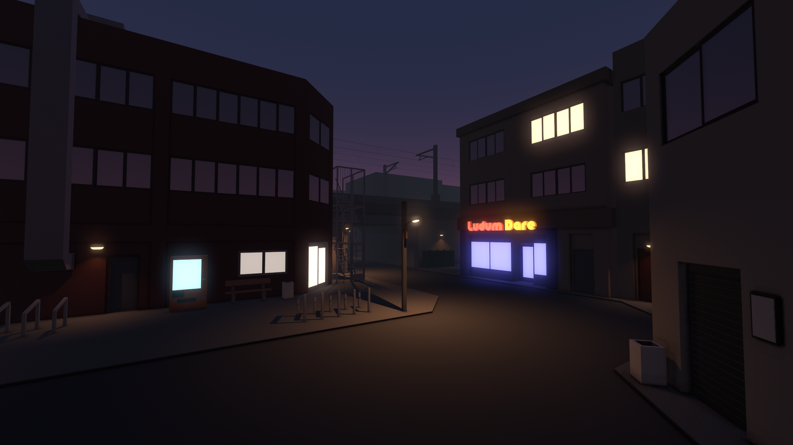

# After Dark

A small 3D cityscape, very loosely inspired by Japanese architecture, created entirely in Godot Engine (no external assets).

Decorated with the Ludum Dare logo, it can be your wallpaper, stream background, etc. for the Ludum Dare game jam!

If you download the project or one of the executable packages, or play the MP4 video, you will also see a cool animation :)

Press <kbd>F11</kbd> for fullscreen.

See [releases](https://github.com/outfrost/composition02/releases) for HD and UltraHD wallpapers, and other downloads.

## License

Copyright 2021 Outfrost

This work is licensed under the [Creative Commons Attribution 4.0 International](https://creativecommons.org/licenses/by/4.0/) license (CC BY 4.0). Feel free to use it, as long as you credit me (@outfrost).
